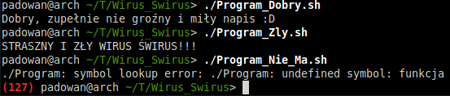

# Wirus_Swirus  
Projekt prezentuje jak tworzyć biblioteki współdzielone oraz jak je podmieniać w istniejących programach.

## Struktura projektu:  
* **[./](./)**  
W katalogu znajduje się program wywołujący funkcję biblioteki AlDomingo oraz skrypty uruchamiające go z odpowiednio podstawioną biblioteką.
* **[AlDomingo](AlDomingo)**  
W katalogu znajduje się podstawowa wersja biblioteki AlDomingo z funkcją wypisującą dobry napis.
* **[Wirus_Swirus](Wirus_Swirus)**  
W katalogu znajduje się podstawowa wersja biblioteki AlDomingo z funkcją wypisującą zły napis.
* **[AlDomingo_Nie_Ma](AlDomingo_Nie_Ma)**  
W katalogu znajduje się podstawowa wersja biblioteki AlDomingo ze zmienioną nazwą funkcji wypisującą dobry napis.
* **[Test_Makefile](Test_Makefile)**  
W katalogu znajduje się test Makefile służący do nauki.

## Wynik działania programu:  

